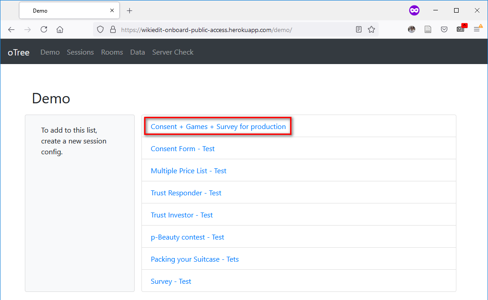

This repository contains the source code for the survey-experiment interface we
used to collect the Pre-treatment measurements.

A publically available demo interface is hosted on Heroku. [Click
here](https://wikiedit-onboard-public-access.herokuapp.com/demo/) to access the
demo interface. Then, click on the link in the red box to launch a demo session,
where one can get a link for single-use link for player **P1**.




----

# Dev notes
## Source of apps
We list the name of the app (dir name) and where we get them, as the start.
1. Holt & Laury: `mpl`, from <https://www.otreehub.com/projects/cl-demo/>, by
   Felix Holzmeister 
    * [ ] Add willingness to pay for revealing the lottery of choice
    * [ ] Prevent multiple-crossing should it occur, and ask subject to redo
2. Trust - investor: `trust_investor`, from `otree_demo`
    1. Tokenized: that there are 5 tokens, each worths 20 points
    2. Converted so that payoff is realized with random-matching with a
       historical play (based on strategy method)
3. Trust - responder: `trust_responder`, from `otree_demo`  
    1. 6 rounds, strategy method, where 0-5 tokens were sent each round.
4. p-Beauty contest: `guess_two_thirds`, from `otree_demo`
5. Pending - Knapsack: 
    * Source: [JavaScript table without retry](https://www.otreehub.com/projects/pack-your-backpack/)
    * JavaScript pulls from the `App/data` folder, for `parts_1.csv` ... as the
      raw list of items in the backpack
    * A folder-full of Javascript files needs to go to
      `/App/_static/java_script/`, with:
    ```
    compute_weight.js
    create_decision_table.js
    create_result_table.js
    save_selection.js
    table_sort.js
    ```


# Summary of apps
Before the main treatment, we were using a battery of MobLab games to collect:
1. Informed consent (first page as people join the experiment);
2. Gender of the participant (for stratified random assignment);
3. A battery of games (see the [Games](#Games) section below for more details)
4. Exist survey, with a bag of questions.

## Games
1. Holt & Laury
2. Trust - investor
3. Trust - responder
4. p-Beauty contest
5. Knapsack: the game should not be as grinding as the MobLab version
    * The game features:
        1. All packages are displayed in a table,
        2. Columns in the table can be sorted
        3. If capacity is reached, there will be a live warning.
    * Source: [JavaScript table without retry](https://www.otreehub.com/projects/pack-your-backpack/)


## Whereabouts of games
1. Consent page: first thing before any other compartment
2. Get all the games ready: 
    * [ ] add bots to games - trust + p-Beauty, along with bot strategies
    List of games and where to find them + pull emperical choices from previous round.
    1. Holt & Laury: [mpl from this oTree package](https://www.otreehub.com/projects/cl-demo/)
        * oTree >= 2.2.4
        * Parameters: 10 pairs of lotteries - (5,4) vs (10, 1), with varying
          probabilities in (1/10, 9/10) ... (1, 0)
        * [ ] On tuning the game: use `config.py` in the folder
            * `enforce_consistency` is implemented without warning: subsequent
              radio buttons are populated automatically.
            * Curiosity: we will show the payoff from the lottery first, at the
              top of the page. The rest of the page has a slider to choose the
              WTP.
                * In th result page, the chosen lottery is reported if the
                  conitoins are satisfied.
        
    2. Trust - investor: adopt from [demo-trust](https://github.com/oTree-org/otree)
    3. Trust - responder: adopt from [demo-investor](https://github.com/oTree-org/otree)
    4. p-Beauty contest: adop from [demo-guess_two_thirds](https://github.com/oTree-org/otree)
    5. Knapsack: the game should not be as grinding as the MobLab version
        * The game features:
            1. All packages are displayed in a table,
            2. Columns in the table can be sorted
            3. If capacity is reached, there will be a warnig.
        * Source: [JavaScript table without retry](https://www.otreehub.com/projects/pack-your-backpack/)
            * oTree >= 2.2.4

## Notes for calculating payoff:
Students do not see their total points at the end of the experiment. Whenever
necessary, the will see the payoff for each round.
1. Holt & Laury with curiosity: payoff is revealed, the exact lottery entry
   chosen for payment is not revealed;
2. Trust responder - Strategy method - revealed payment upon finishing
3. Trust investor - paired with a randomly drawn opponent, payoff revealed upon
   finishing;
4. p-Beauty contest: over 5 rounds, 1 round is chosen for payment. There is a
   payment page at the end of all 5 arouds.

## Caveats:
### Games are scheduled in fixed order if launched in one session.
For apps hosted in a session, the app sequence is fixed
* Comment 1, from the forum, confirming that app-sequence is fixed: [Randomization of app sequence per player or group](https://groups.google.com/g/otree/c/JHP91_ZpGos/m/tj1UhOSGAAAJ)
* Discussion 2: `app_after_this_page` may be helpful, but not necessarily - [New
  beta feature: skipping many pages or apps](https://groups.google.com/g/otree/c/T6DsbOv712Q/m/Qq_Tv8ZBAgAJ)

* [ ] There is a way to solve this, to span out all combination of the app
      sequences and send them out from a full set of sessions. This adds to
      the administrative burden, and may be suitable a team of at least two RAs.

### We did not get the Competitiveness game to work

Pending - Competitiveness: pending - not sure if the task sufficies
   <https://github.com/otree-tools/jbef-channels#niederle2007>, the demo works
   remotely, and should need `otree==2.5.8` (older oTree)
    * [x] Runs locally with `oo_create`, a Zsh function
    * [x] Need Python Runtime to be `python-3.7.4`, in the `runtime.txt` file when
      pubhsed to Heroku
    * Now the thing runs on Heroku, with an added Redis database

# Technical notes for reusing the app
Need `otree 3.2.7`


## The app for production
The "app sequence" for production is as the following. The relevant app is named
as "production" in `settings.py`.

```
'Consent', 
'mpl', 'trust_responder', 'trust_investor', 'guess_two_thirds', 'simple_knapsack', 
'survey'
```

## Style of the games
`custom.css` is reused heavily. Originally, this file is from `mpl`. Hosting
with refernces to `mpl` created problem with Heroku.
```

    <link href="" rel="stylesheet"/>


    <div class="wrapper instructions">
    Then, the formal intro and instrucitons.
    </div>
```
This CSS sheet is reused heavily throughout this deck of oTree apps.


